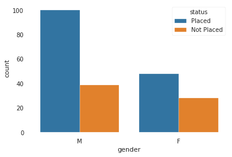

# FTDS Complementary // Model Deployment
Data scientist sering kali harus menyampaikan hasil kepada orang lain. Dalam beberapa kasus, supervisor/atasan mungkin ingin melihat beberapa angka atau kita harus menuliskan main insights dari beberapa pekerjaan. Ini cukup mudah - kita hanya copy dan paste ke email atau dokumen Latex. Tetapi bagaimana jika kita ingin mengirim seseorang model sebenarnya yang telah kita latih, sehingga mereka dapat mengevaluasi atau menggunakannya? Jika orang yang dimaksud cukup teknis, maka kita bisa menyimpan model ke disk dan kirim via email, bersama dengan beberapa notebook Jupyter.

Tetapi bagaimana jika kita ingin seseorang di bagian marketing mencoba sebuah model, atau kita ingin membagikannya dengan teman-teman yang mungkin menganggapnya menarik? Dalam kasus ini, kita harus membuat kode kita dapat diakses oleh mereka dengan cara yang mereka kenal.

Tiga bagian dari sesi ini adalah:

- Creating a simple model that can be deployed to the web, where users can input variables to get predictions.
- Building the components needed by Flask microframework to create a web app.
- Deploying the final web app using the Heroku platform.

## Creating Model for Deployment
Kita dapat menerapkan dari model yang kita buat sebelumnya; atau jika kita menginginkan model baru, ikuti langkah di bawah ini. Ambil data yang digunakan dari [sini](https://www.kaggle.com/benroshan/factors-affecting-campus-placement).

Dataset tersebut terdiri dari data penempatan siswa di kampus XYZ. Mencakup secondary dan higher secondary school percentage dan specialization. Ini juga mencakup degree specialization, type dan Work experience dan tawaran salary kepada siswa yang ditempatkan.

### Importing Libraries
Notes: Profiling boleh diinstall atau tidak diinstall. Dalam sesi ini, profiling hanya digunakan menjadi contoh untuk memudahkan analisa.

Lewati cell `report = data.profile_report(title='Campus Placement Data - Report', progress_bar=False)` Jika memutuskan untuk tidak menggunakan profiling.

```python
!pip install pandas_profiling
```

```python
Requirement already satisfied: pandas_profiling in c:\users\rakay\appdata\local\programs\python\python38\lib\site-packages (2.9.0)
```

```python
import pandas as pd
import numpy as np
import matplotlib.pyplot as plt
import seaborn as sns
import pandas_profiling
import pickle

%matplotlib inline
```

```python
data = pd.read_csv('Placement_Data_Full_Class.csv')

#Remove Serial Number
data.drop("sl_no", axis=1, inplace=True)
```

### Examining Dataset

```python
data.head()
```
|   | gender | ssc_p | ssc_b   | hsc_p | hsc_b   | hsc_s    | degree_p | degree_t  | workex | etest_p | specialisation | mba_p | status     | salary |
|---|--------|-------|---------|-------|---------|----------|----------|-----------|--------|---------|----------------|-------|------------|--------|
| 0 | M      | 67    | Others  | 91    | Others  | Commerce | 58       | Sci&Tech  | No     | 55      | Mkt&HR         | 58.8  | Placed     | 270000 |
| 1 | M      | 79.33 | Central | 78.33 | Others  | Science  | 77.48    | Sci&Tech  | Yes    | 86.5    | Mkt&Fin        | 66.28 | Placed     | 200000 |
| 2 | M      | 65    | Central | 68    | Central | Arts     | 64       | Comm&Mgmt | No     | 75      | Mkt&Fin        | 57.8  | Placed     | 250000 |
| 3 | M      | 56    | Central | 52    | Central | Science  | 52       | Sci&Tech  | No     | 66      | Mkt&HR         | 59.43 | Not Placed | NaN    |
| 4 | M      | 85.8  | Central | 73.6  | Central | Commerce | 73.3     | Comm&Mgmt | No     | 96.8    | Mkt&Fin        | 55.5  | Placed     | 425000 |

#### Inference

- We have Gender and Educational qualification data
- We have all the educational performance(score) data
- We have the status of placement and salary details
- We can expect null values in salary as candidates who weren't placed would have no salary
- Status of placement is our target variable rest of them are independent variable except salary

```python
print ("The shape of the  data is (row, column):"+ str(data.shape))
print (data.info())
```

```python
The shape of the  data is (row, column):(215, 14)
<class 'pandas.core.frame.DataFrame'>
RangeIndex: 215 entries, 0 to 214
Data columns (total 14 columns):
 #   Column          Non-Null Count  Dtype  
---  ------          --------------  -----  
 0   gender          215 non-null    object 
 1   ssc_p           215 non-null    float64
 2   ssc_b           215 non-null    object 
 3   hsc_p           215 non-null    float64
 4   hsc_b           215 non-null    object 
 5   hsc_s           215 non-null    object 
 6   degree_p        215 non-null    float64
 7   degree_t        215 non-null    object 
 8   workex          215 non-null    object 
 9   etest_p         215 non-null    float64
 10  specialisation  215 non-null    object 
 11  mba_p           215 non-null    float64
 12  status          215 non-null    object 
 13  salary          148 non-null    float64
dtypes: float64(6), object(8)
memory usage: 23.6+ KB
None
```

```python
report = data.profile_report(title='Campus Placement Data - Report',
                             progress_bar=False)
report

# Uncomment syntax below to make new html file

# report.to_file(output_file='output.html')
```
- 67 Missing values in Salary for students who didn't get placed. NaN Value needs to be filled.
- Data is not scaled. Salary column ranges from 200k-940k, rest of numerical columns are percentages.
- 300k at 75th Percentile goes all the way up to 940k max, in Salary (high skewnwss). Thus, outliers at high salary end.

### Data Cleaning / Handling missing values

```python
data['salary'].fillna(value=0, inplace=True)
print('Salary column with null values:',
      data['salary'].isnull().sum(), sep = '\n')
```

```python
Salary column with null values:
0
```

### Exploring Data by each Features (Optional)

```python
"""
Feature: Gender

Does gender affect placements?
"""

data.gender.value_counts()
```

```python
M    139
F     76
Name: gender, dtype: int64
```
```python
sns.countplot("gender", hue="status", data=data)
plt.show()
```



```python
sns.kdeplot(data.salary[data.gender=="M"])
sns.kdeplot(data.salary[data.gender=="F"])
plt.legend(["Male", "Female"])
plt.xlabel("Salary (100k)")
plt.show()
```