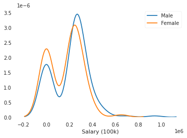
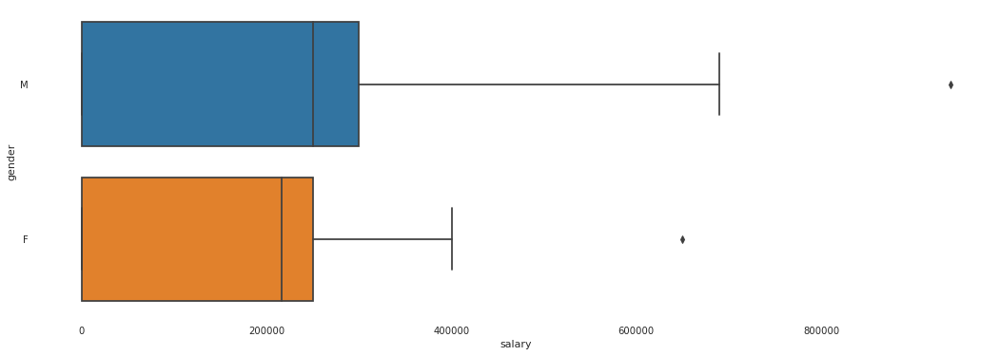
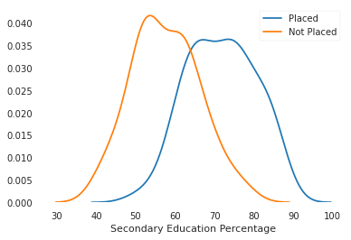
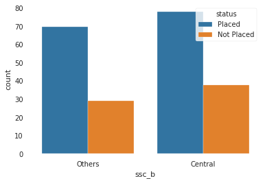
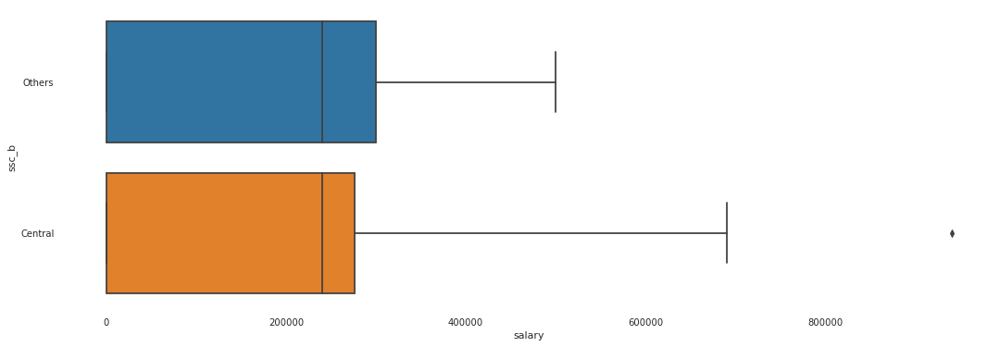
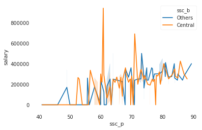
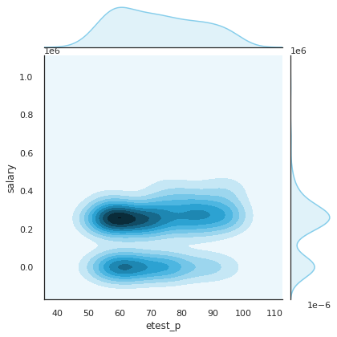
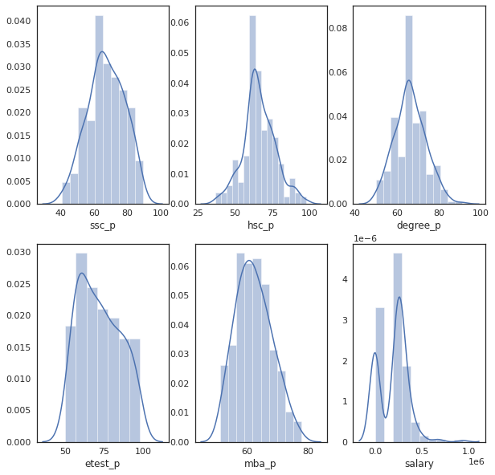
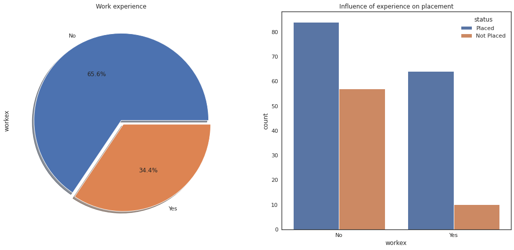

# FTDS Complementary // Model Deployment
Data scientist sering kali harus menyampaikan hasil kepada orang lain. Dalam beberapa kasus, supervisor/atasan mungkin ingin melihat beberapa angka atau kita harus menuliskan main insights dari beberapa pekerjaan. Ini cukup mudah - kita hanya copy dan paste ke email atau dokumen Latex. Tetapi bagaimana jika kita ingin mengirim seseorang model sebenarnya yang telah kita latih, sehingga mereka dapat mengevaluasi atau menggunakannya? Jika orang yang dimaksud cukup teknis, maka kita bisa menyimpan model ke disk dan kirim via email, bersama dengan beberapa notebook Jupyter.

Tetapi bagaimana jika kita ingin seseorang di bagian marketing mencoba sebuah model, atau kita ingin membagikannya dengan teman-teman yang mungkin menganggapnya menarik? Dalam kasus ini, kita harus membuat kode kita dapat diakses oleh mereka dengan cara yang mereka kenal.

Tiga bagian dari sesi ini adalah:

- Creating a simple model that can be deployed to the web, where users can input variables to get predictions.
- Building the components needed by Flask microframework to create a web app.
- Deploying the final web app using the Heroku platform.

## Creating Model for Deployment
Kita dapat menerapkan dari model yang kita buat sebelumnya; atau jika kita menginginkan model baru, ikuti langkah di bawah ini. Ambil data yang digunakan dari [sini](https://www.kaggle.com/benroshan/factors-affecting-campus-placement).

Dataset tersebut terdiri dari data penempatan siswa di kampus XYZ. Mencakup secondary dan higher secondary school percentage dan specialization. Ini juga mencakup degree specialization, type dan Work experience dan tawaran salary kepada siswa yang ditempatkan.

### Importing Libraries
Notes: Profiling boleh diinstall atau tidak diinstall. Dalam sesi ini, profiling hanya digunakan menjadi contoh untuk memudahkan analisa.

Lewati cell `report = data.profile_report(title='Campus Placement Data - Report', progress_bar=False)` Jika memutuskan untuk tidak menggunakan profiling.

```python
!pip install pandas_profiling
```

```python
Requirement already satisfied: pandas_profiling in c:\users\rakay\appdata\local\programs\python\python38\lib\site-packages (2.9.0)
```

```python
import pandas as pd
import numpy as np
import matplotlib.pyplot as plt
import seaborn as sns
import pandas_profiling
import pickle

%matplotlib inline
```

```python
data = pd.read_csv('Placement_Data_Full_Class.csv')

#Remove Serial Number
data.drop("sl_no", axis=1, inplace=True)
```

### Examining Dataset

```python
data.head()
```
|   | gender | ssc_p | ssc_b   | hsc_p | hsc_b   | hsc_s    | degree_p | degree_t  | workex | etest_p | specialisation | mba_p | status     | salary |
|---|--------|-------|---------|-------|---------|----------|----------|-----------|--------|---------|----------------|-------|------------|--------|
| 0 | M      | 67    | Others  | 91    | Others  | Commerce | 58       | Sci&Tech  | No     | 55      | Mkt&HR         | 58.8  | Placed     | 270000 |
| 1 | M      | 79.33 | Central | 78.33 | Others  | Science  | 77.48    | Sci&Tech  | Yes    | 86.5    | Mkt&Fin        | 66.28 | Placed     | 200000 |
| 2 | M      | 65    | Central | 68    | Central | Arts     | 64       | Comm&Mgmt | No     | 75      | Mkt&Fin        | 57.8  | Placed     | 250000 |
| 3 | M      | 56    | Central | 52    | Central | Science  | 52       | Sci&Tech  | No     | 66      | Mkt&HR         | 59.43 | Not Placed | NaN    |
| 4 | M      | 85.8  | Central | 73.6  | Central | Commerce | 73.3     | Comm&Mgmt | No     | 96.8    | Mkt&Fin        | 55.5  | Placed     | 425000 |

#### Inference

- We have Gender and Educational qualification data
- We have all the educational performance(score) data
- We have the status of placement and salary details
- We can expect null values in salary as candidates who weren't placed would have no salary
- Status of placement is our target variable rest of them are independent variable except salary

```python
print ("The shape of the  data is (row, column):"+ str(data.shape))
print (data.info())
```

```python
The shape of the  data is (row, column):(215, 14)
<class 'pandas.core.frame.DataFrame'>
RangeIndex: 215 entries, 0 to 214
Data columns (total 14 columns):
 #   Column          Non-Null Count  Dtype  
---  ------          --------------  -----  
 0   gender          215 non-null    object 
 1   ssc_p           215 non-null    float64
 2   ssc_b           215 non-null    object 
 3   hsc_p           215 non-null    float64
 4   hsc_b           215 non-null    object 
 5   hsc_s           215 non-null    object 
 6   degree_p        215 non-null    float64
 7   degree_t        215 non-null    object 
 8   workex          215 non-null    object 
 9   etest_p         215 non-null    float64
 10  specialisation  215 non-null    object 
 11  mba_p           215 non-null    float64
 12  status          215 non-null    object 
 13  salary          148 non-null    float64
dtypes: float64(6), object(8)
memory usage: 23.6+ KB
None
```

```python
report = data.profile_report(title='Campus Placement Data - Report',
                             progress_bar=False)
report

# Uncomment syntax below to make new html file

# report.to_file(output_file='output.html')
```

[Profile Report](./report/output.html)
- 67 Missing values in Salary for students who didn't get placed. NaN Value needs to be filled.
- Data is not scaled. Salary column ranges from 200k-940k, rest of numerical columns are percentages.
- 300k at 75th Percentile goes all the way up to 940k max, in Salary (high skewnwss). Thus, outliers at high salary end.

### Data Cleaning / Handling missing values

```python
data['salary'].fillna(value=0, inplace=True)
print('Salary column with null values:',
      data['salary'].isnull().sum(), sep = '\n')
```

```python
Salary column with null values:
0
```

### Exploring Data by each Features (Optional)

```python
"""
Feature: Gender

Does gender affect placements?
"""

data.gender.value_counts()
```

```python
M    139
F     76
Name: gender, dtype: int64
```
```python
sns.countplot("gender", hue="status", data=data)
plt.show()
```


```python
sns.kdeplot(data.salary[data.gender=="M"])
sns.kdeplot(data.salary[data.gender=="F"])
plt.legend(["Male", "Female"])
plt.xlabel("Salary (100k)")
plt.show()
```



```python
plt.figure(figsize =(18,6))
sns.boxplot("salary", "gender", data=data)
plt.show()
```



#### Insights

- We have samples of 139 Male studets and 76 Female students.
- 30 Female and 40 Male students are not placed. Male students have comparatively higher placemets.
- Male students are offered slightly greater salary than female on an average.

```python
"""
Feature: ssc_p (Secondary Education percentage), ssc_b (Board Of Education)

Does Secondary Education affect placements?
"""
sns.kdeplot(data.ssc_p[data.status=="Placed"])
sns.kdeplot(data.ssc_p[data.status=="Not Placed"])
plt.legend(["Placed", "Not Placed"])
plt.xlabel("Secondary Education Percentage")
plt.show()
```



- All students with Secondary Education Percentage above 90% are placed
- All students with Secondary Education Percentage below 50% are not-placed
- Students with good Secondary Education Percentage are placed on average.

```python
sns.countplot("ssc_b", hue="status", data=data)
plt.show()
```



Board Of Education tidak banyak mempengaruhi Placement Status.

```python

plt.figure(figsize =(18,6))
sns.boxplot("salary", "ssc_b", data=data)
plt.show()
```



Outliers terdapat pada keduanya, tetapi siswa dari Central Board mendapatkan pekerjaan bergaji tinggi.

```python
sns.lineplot("ssc_p", "salary", hue="ssc_b", data=data)
plt.show()
```



Tidak ada pola khusus (correlation) antara Secondary Education Percentage dan Salary. Board of Education Tidak Mempengaruhi Gaji

Kita dapat membuat grafik sendiri dari sini.

```python
sns.set(rc={'figure.figsize':(12,8)})
sns.set(style="white", color_codes=True)
sns.jointplot(x=data["etest_p"], y=data["salary"], kind='kde', color="skyblue")

plt.show()
```



- Most of the candidates scored around 60 percentage got a decent package of around 3 lakhs PA
- Not many candidates received salary more than 4 lakhs PA
- The bottom dense part shows the candidates who were not placed

```python
plt.figure(figsize = (15, 7))
plt.style.use('seaborn-white')
plt.subplot(231)
sns.distplot(data['ssc_p'])
fig = plt.gcf()
fig.set_size_inches(10,10)

plt.subplot(232)
sns.distplot(data['hsc_p'])
fig = plt.gcf()
fig.set_size_inches(10,10)

plt.subplot(233)
sns.distplot(data['degree_p'])
fig = plt.gcf()
fig.set_size_inches(10,10)

plt.subplot(234)
sns.distplot(data['etest_p'])
fig = plt.gcf()
fig.set_size_inches(10,10)

plt.subplot(235)
sns.distplot(data['mba_p'])
fig = plt.gcf()
fig.set_size_inches(10,10)

plt.subplot(236)
sns.distplot(data['salary'])
fig = plt.gcf()
fig.set_size_inches(10,10)
```



- All the distributions follow normal distribution except salary feature
- Most of the candidates educational performances are between 60-80%
- Salary distribution got outliers where few have got salary of 7.5L and 10L PA

```python
plt.style.use('seaborn-white')
f,ax=plt.subplots(1,2,figsize=(18,8))
data['workex'].value_counts().plot.pie(explode=[0,0.05], autopct='%1.1f%%', ax=ax[0], shadow=True)
ax[0].set_title('Work experience')
sns.countplot(x = 'workex',hue = "status",data = data)
ax[1].set_title('Influence of experience on placement')

plt.show()
```



- We have nearly 66.2% of candidates who never had any work experience
- Candidates who never had work experience have got hired more than the ones who had experience
- We can conclude that work experience doesn't influence a candidate in the recruitment process

### Preprocessing data for classfication models

```python
from sklearn.preprocessing import LabelEncoder

object_cols = ['gender','workex','specialisation','status']

label_encoder = LabelEncoder()
for col in object_cols:
    data[col] = label_encoder.fit_transform(data[col])
data.head()
```

|   | gender | ssc_p | ssc_b   | hsc_p | hsc_b   | hsc_s    | degree_p | degree_t  | workex | etest_p | specialisation | mba_p | status | salary |
|---|--------|-------|---------|-------|---------|----------|----------|-----------|--------|---------|----------------|-------|--------|--------|
| 0 | 1      | 67    | Others  | 91    | Others  | Commerce | 58       | Sci&Tech  | 0      | 55      | 1              | 58.8  | 1      | 270000 |
| 1 | 1      | 79.33 | Central | 78.33 | Others  | Science  | 77.48    | Sci&Tech  | 1      | 86.5    | 0              | 66.28 | 1      | 200000 |
| 2 | 1      | 65    | Central | 68    | Central | Arts     | 64       | Comm&Mgmt | 0      | 75      | 0              | 57.8  | 1      | 250000 |
| 3 | 1      | 56    | Central | 52    | Central | Science  | 52       | Sci&Tech  | 0      | 66      | 1              | 59.43 | 0      | 0      |
| 4 | 1      | 85.8  | Central | 73.6  | Central | Commerce | 73.3     | Comm&Mgmt | 0      | 96.8    | 0              | 55.5  | 1      | 425000 |

```python
# Library imports
from sklearn.tree import DecisionTreeClassifier
from sklearn.ensemble import RandomForestClassifier
from sklearn.linear_model import LogisticRegression

from sklearn.model_selection import train_test_split
from sklearn.metrics import accuracy_score, classification_report
```

```python
# Seperating Features and Target
X = data[['ssc_p', 'hsc_p', 'degree_p', 'etest_p']]
y = data['status']
```

```python
#Train Test Split
X_train, X_test, y_train, y_test = train_test_split(X, y, test_size=0.3, random_state=4)
```

```python
# Decision Tree
dtree = DecisionTreeClassifier(criterion='entropy')
dtree.fit(X_train, y_train)

y_pred = dtree.predict(X_test)

print("Accuracy Score:", accuracy_score(y_test, y_pred))
print(classification_report(y_test, y_pred))
```

```
Accuracy Score: 0.8307692307692308
              precision    recall  f1-score   support

           0       0.74      0.70      0.72        20
           1       0.87      0.89      0.88        45

    accuracy                           0.83        65
   macro avg       0.80      0.79      0.80        65
weighted avg       0.83      0.83      0.83        65
```

```python
#Using Random Forest
random_forest = RandomForestClassifier(n_estimators=100)
random_forest.fit(X_train, y_train)

y_pred = random_forest.predict(X_test)

print("Accuracy Score:", accuracy_score(y_test, y_pred))
print(classification_report(y_test, y_pred))
```

```
Accuracy Score: 0.8615384615384616
              precision    recall  f1-score   support

           0       0.82      0.70      0.76        20
           1       0.88      0.93      0.90        45

    accuracy                           0.86        65
   macro avg       0.85      0.82      0.83        65
weighted avg       0.86      0.86      0.86        65
```

```python
#Using Logistic Regression

LogR = LogisticRegression(solver='lbfgs')
LogR.fit(X_train, y_train)

y_pred = LogR.predict(X_test)

print("Accuracy Score:", accuracy_score(y_test, y_pred))
print(classification_report(y_test, y_pred))
```

```
Accuracy Score: 0.8461538461538461
              precision    recall  f1-score   support

           0       0.78      0.70      0.74        20
           1       0.87      0.91      0.89        45

    accuracy                           0.85        65
   macro avg       0.83      0.81      0.81        65
weighted avg       0.84      0.85      0.84        65
```

### Getting ready for deployment
#### Pickle

Modul pickle Python digunakan untuk serializing dan de-serializing struktur objek Python. Objek apa pun dengan Python dapat dibuat pickled sehingga dapat disimpan di disk. Apa yang dilakukan pickle adalah 'serializes' objek terlebih dahulu sebelum menulisnya ke file. Pickling adalah cara untuk mengubah objek python (list, dict, etc.) Menjadi character stream. Idenya adalah bahwa character stream ini berisi semua informasi yang diperlukan untuk merekonstruksi objek dalam skrip python lain.

```python
pickle.dump(random_forest, open('model_classifier.pkl','wb'))
```

## Brief introduction to HTML and CSS
HTML adalah standard markup language untuk membuat halaman Web.

### What is HTML?
- HTML stands for Hyper Text Markup Language
- HTML is the standard markup language for creating Web pages
- HTML describes the structure of a Web page
- HTML consists of a series of elements
- HTML elements tell the browser how to display the content
- HTML elements label pieces of content such as "this is a heading", "this is a paragraph", "this is a link", etc.

A Simple HTML Document
```html
<!DOCTYPE html>
<html>
<head>
  <title>Page Title</title>
</head>
<body>

  <h1>My First Heading</h1>
  <p>My first paragraph.</p>

</body>
</html>
```

- `<!DOCTYPE html>` mendefinisikan bahwa dokumen ini adalah dokumen HTML5
- `<html>` elemen adalah elemen root dari halaman HTML
- `<head>` elemen berisi informasi meta tentang halaman HTML
- `<title>` elemen menentukan judul untuk halaman HTML (yang ditampilkan di judul browser atau di tab halaman)
- `<body>` elemen mendefinisikan badan dokumen, dan merupakan wadah untuk semua konten yang terlihat, seperti headings, paragraphs, images, hyperlinks, tables, lists, dll.
- `<h1>` elemen mendefinisikan headingbesar
- The `<p>` element mendefinisikan sebuah paragraph

### What is an HTML Element?

Elemen HTML ditentukan oleh tag awal, beberapa konten, dan tag akhir:

`<tagname>Content goes here...</tagname>`

Elemen HTML adalah apapun yang dimulai dari tag awal hingga tag akhir:

```html
<h1>My First Heading</h1>
<p>My first paragraph.</p>
```

CSS adalah singkatan dari Cascading Style Sheets.

CSS menghemat banyak pekerjaan. CSS dapat mengontrol tata letak beberapa halaman web sekaligus.

### What is CSS?

Cascading Style Sheets (CSS) digunakan untuk memformat tata letak halaman web.

Dengan CSS, kita dapat mengontrol warna, font, ukuran teks, jarak antar elemen, bagaimana elemen diposisikan dan ditata, gambar latar belakang atau warna latar yang akan digunakan, tampilan yang berbeda untuk perangkat dan ukuran layar yang berbeda, dan banyak lagi.

### CSS Syntax

Set aturan CSS terdiri dari selector dan declaration block:


- The selector points to the HTML element you want to style.
- The declaration block contains one or more declarations separated by semicolons.
- Each declaration includes a CSS property name and a value, separated by a colon.
- Multiple CSS declarations are separated with semicolons, and declaration blocks are surrounded by curly braces.

### Using CSS

CSS dapat ditambahkan ke dokumen HTML dengan 3 cara:

- Inline - by using the `style` attribute inside HTML elements
- Internal - by using a `<style>` element in the `<head>` section
- External - by using a `<link>` element to link to an external CSS file

Cara paling umum untuk menambahkan CSS, adalah menempatkan style dalam file CSS eksternal.

### Inline CSS

Inline CSS digunakan untuk menerapkan style unik ke satu elemen HTML.

Inline CSS menggunakan style attribute dari elemen HTML.

Contoh berikut bagaimana cara mengatur warna teks elemen `<h1>` menjadi biru, dan warna teks elemen `<p>` menjadi merah:

```html
<h1 style="color:blue;">A Blue Heading</h1>

<p style="color:red;">A red paragraph.</p>
```

### Internal CSS

CSS internal digunakan untuk menentukan style untuk satu halaman HTML.

CSS internal ditentukan di bagian `<head>` halaman HTML, dalam elemen `<style>`.

Contoh berikut mengatur warna teks SEMUA elemen `<h1>` (pada halaman itu) menjadi biru, dan warna teks SEMUA elemen <p> menjadi merah. Selain itu, halaman akan ditampilkan dengan warna latar belakang `"powderblue"`:

```html
<!DOCTYPE html>
<html>
<head>
<style>
  body {background-color: powderblue;}
  h1   {color: blue;}
  p    {color: red;}
</style>
</head>
<body>

  <h1>This is a heading</h1>
  <p>This is a paragraph.</p>

</body>
</html>
```

### External CSS

Style sheet eksternal digunakan untuk menentukan style untuk banyak halaman HTML.

Untuk menggunakan style sheet eksternal, tambahkan link ke dalamnya di bagian `<head>` pada setiap halaman HTML:

```html
<!DOCTYPE html>
<html>
<head>
  <link rel="stylesheet" href="styles.css">
</head>
<body>

  <h1>This is a heading</h1>
  <p>This is a paragraph.</p>

</body>
</html>
```

Style sheet eksternal dapat ditulis di editor teks manapun. File tidak boleh berisi kode HTML apa pun, dan harus disimpan dengan ekstensi `.css`.

Berikut adalah tampilan file `styles.css`:

```css
body {
  background-color: powderblue;
}
h1 {
  color: blue;
}
p {
  color: red;
}
```

### Creating web app with Flask

Pastikan flask sudah terinstall dengan `pip install flask`.

Minimal Flask application terlihat seperti ini:

```python
from flask import Flask
app = Flask(__name__)

@app.route('/')
def hello_world():
    return 'Hello, World!'
```

Jadi apa yang dilakukan kode tersebut?

- Pertama kita mengimpor kelas `Flask`. Instance dari kelas ini adalah aplikasi WSGI kita.
- Selanjutnya kita membuat instance dari kelas ini. Argumen pertama adalah nama modul atau paket aplikasi. Jika kita menggunakan satu modul (seperti dalam contoh ini), kita harus menggunakan `__name__` karena bergantung pada apakah aplikasi tersebut dimulai sebagai aplikasi atau diimpor sebagai modul, namanya akan berbeda (`'__main__'` versus nama impor sebenarnya). Ini diperlukan agar Flask tahu di mana mencari templates, static files, dan lain-lain.
- Kita kemudian menggunakan dekorator `route()` untuk memberi tahu Flask, URL apa yang harus mentrigger fungsi kita.
- Fungsi tersebut diberi nama yang juga digunakan untuk menghasilkan URL untuk fungsi tertentu itu, dan mengembalikan pesan yang ingin kita tampilkan di browser pengguna.

Simpan sebagai `hello.py` atau yang serupa. Pastikan untuk tidak memanggil aplikasi kita `flask.py` karena ini akan conflict dengan Flask itu sendiri.

Untuk menjalankan aplikasi, kita dapat menggunakan perintah flask atau switch -m python dengan Flask. Sebelum kita dapat melakukannya, kita perlu memberi tahu terminal tentang aplikasi yang akan digunakan dengan mengekspor FLASK_APP environment variable:

```shell
$ export FLASK_APP=hello.py
$ flask run
 * Running on http://127.0.0.1:5000/
```

Command ini meluncurkan server bawaan yang sangat sederhana, yang cukup baik untuk testing tetapi mungkin bukan yang ingin Anda gunakan dalam production.

Sekarang akses ke http://127.0.0.1:5000/, dan kita akan melihat hello world.

### Debug Mode

Script flask sangat bagus untuk memulai server local development, tetapi kita harus merestart secara manual setelah setiap perubahan pada kode kita. Hal itu tidak bagus dan Flask bisa melakukannya dengan lebih baik. Jika kita mengaktifkan debug support, server akan merestart dirinya sendiri pada perubahan kode, dan itu juga akan memberi kita debugger yang berguna jika terjadi kesalahan.

Untuk mengaktifkan semua fitur development (termasuk mode debug) kita dapat mengekspor `FLASK_ENV` environment variable dan menyetelnya ke `development` sebelum menjalankan server:

```shell
$ export FLASK_ENV=development
$ flask run
```
(On Windows you need to use set instead of export.)

Hal tersebut melakukan hal-hal berikut:

- it activates the debugger
- it activates the automatic reloader
- it enables the debug mode on the Flask application.

Kita juga dapat mengontrol mode debug secara terpisah dari environment dengan mengekspor `FLASK_DEBUG=1`.

### Routing

Aplikasi web modern menggunakan URL yang meaningful untuk membantu pengguna. Pengguna lebih cenderung menyukai halaman dan kembali jika halaman tersebut menggunakan URL yang meaningful yang dapat mereka ingat dan gunakan untuk mengunjungi halaman secara langsung.

Gunakan dekorator `route()` untuk mengikat fungsi ke URL.

```python
@app.route('/')
def index():
    return 'Index Page'

@app.route('/hello')
def hello():
    return 'Hello, World'
```

### Variable Rules

Kita dapat menambahkan bagian variabel ke URL dengan menandai bagian dengan `<variable_name>`. Fungsi kita kemudian menerima masukan sebagai keyword argument. Secara opsional, kita  bisa menggunakan konverter untuk menentukan tipe argumen seperti `<converter:variable_name>`.

```python
from markupsafe import escape

@app.route('/user/<username>')
def show_user_profile(username):
    # show the user profile for that user
    return 'User %s' % escape(username)

@app.route('/post/<int:post_id>')
def show_post(post_id):
    # show the post with the given id, the id is an integer
    return 'Post %d' % post_id

@app.route('/path/<path:subpath>')
def show_subpath(subpath):
    # show the subpath after /path/
    return 'Subpath %s' % escape(subpath)
```

### HTTP Methods

Aplikasi web menggunakan metode HTTP yang berbeda saat mengakses URL. Kita harus membiasakan diri dengan metode HTTP saat kita bekerja dengan Flask. Secara default, route hanya menjawab permintaan `GET`. Kita bisa menggunakan argumen metode dekorator `route()` untuk menangani metode HTTP yang berbeda.

from flask import request

@app.route('/login', methods=['GET', 'POST'])
def login():
    if request.method == 'POST':
        return do_the_login()
    else:
        return show_the_login_form()
Jika GET tersedia, Flask secara otomatis menambahkan dukungan untuk metode `HEAD` dan menangani permintaan `HEAD` sesuai dengan HTTP RFC. Demikian juga, OPTIONS diterapkan secara otomatis untuk kita.

### Static Files

Aplikasi web dinamis juga membutuhkan file statis. Biasanya dari situlah file CSS dan JavaScript berasal. Idealnya server web kita dikonfigurasi untuk menyajikannya untuk kita , tetapi selama pengembangan, Flask juga dapat melakukannya. Cukup buat folder bernama static dalam paket kita atau di sebelah modul kita dan itu akan tersedia di /static pada aplikasi.

Untuk menghasilkan URL untuk file statis, gunakan endpoint name 'static':

`url_for('static', filename='style.css')`

File harus disimpan di sistem file sebagai static/style.css.

### Rendering Templates

Membuat HTML dari dalam Python tidaklah menyenangkan, dan sebenarnya cukup rumit karena kita harus melakukan HTML escaping sendiri untuk menjaga keamanan aplikasi. Karena itu Flask mengkonfigurasi template engine Jinja2 untuk kita  secara otomatis.

Untuk merender template kita bisa menggunakan metode `render_template()`. Yang harus kita lakukan adalah memberikan nama template dan variabel yang ingin kita teruskan ke template engine sebagai keyword arguments. Berikut adalah contoh sederhana tentang cara merender template:

```python
from flask import render_template

@app.route('/hello/')
@app.route('/hello/<name>')
def hello(name=None):
    return render_template('hello.html', name=name)
```

Flask akan mencari templates di folder templates . Jadi, jika aplikasi kita adalah sebuah modul, folder ini berada di sebelah modul tersebut, jika itu sebuah paket, itu sebenarnya ada di dalam packagekita:

Case 1: a module:

```
/application.py
/templates
    /hello.html
```

Case 2: a package:

```
/application
    /__init__.py
    /templates
        /hello.html
```

Untuk template, kita dapat menggunakan template Jinja2.

Berikut ini contoh template:

```html
<!doctype html>
<title>Hello from Flask</title>

  <h1>Hello {{ name }}!</h1>

  <h1>Hello, World!</h1>

```

### Make our own Flask

Ada beberapa hal yang perlu kita kumpulkan untuk aplikasi web. Dua yang pertama adalah:

- The Python code that will load our model, get user input from a web form, do predictions, return results.
- The HTML templates that flask with render. These allow the user to input their own data and will present the results.

Aplikasi kita pada awalnya akan memiliki struktur seperti ini:

```
H8Deployment/
    ├── model/
    │   └── model_classifier.pkl
    ├── static
    │   └── css
    │        └── style.css
    ├── templates/
    │   └── main.html
    └── app.py
```

1. model — Ini berisi kode untuk Machine Learning kita.
1. app.py — Ini berisi Flask API yang menerima detail siswa melalui panggilan GUI atau API, menghitung nilai yang diprediksi berdasarkan model kita dan mengembalikannya.
1. template — Folder ini berisi template HTML (main.html) untuk memungkinkan pengguna memasukkan detail siswa dan menampilkan nilai prediksi.
1. static — Folder ini berisi folder css dengan file style.css yang memiliki stryleyang diperlukan untuk file main.html.

Pertama-tama kita akan membuat `app.py` dan `main.html` yang sangat mendasar, untuk mendemonstrasikan cara kerja flask. Kita akan mengembangkannya nanti untuk menyesuaikan dengan kebutuhan kita.

### app.py

Ini adalah inti dari aplikasi web kita. app.py juga yang akan dijalankan di server Heroku, mengirimkan halaman web dan memproses masukan dari pengguna.

Dalam flask, URL dirutekan ke fungsi yang berbeda. Di sini, kita dapat melihat bahwa membuka URL dasar (mis. www.ardhiraka.com) akan memicu fungsi `main()`. Fungsi ini hanya menyajikan file `main.html`, yang lokasinya ditentukan saat aplikasi dibuat. Kita dapat mengatur semua jenis routes untuk logging in, displaying data atau lainnya.

```python
import flask

app = flask.Flask(__name__, template_folder='templates')

@app.route('/')
def main():
    return(flask.render_template('main.html'))
if __name__ == '__main__':
    app.run()
```

### main.html

Seperti inilah tampilan file template saat ini. Yang dilakukannya hanyalah menampilkan pesan sederhana. Kita akan mengeditnya nanti untuk menyesuaikan dengan kebutuhan kita.

```html
<!DOCTYPE html>
<html lang="en">
<head>
    <meta charset="UTF-8">
    <meta name="viewport" content="width=device-width, initial-scale=1.0">
    <title>H8 Model Deployment</title>
</head>
<body>
    <h1>Welcome to My First Flask Apps!</h1>
</body>
</html>
```

### Running the test app

Untuk memulai flask di komputer lokal kita, pastikan kita berada di folder `H8Deployment` dan jalankan perintah: `python app.py`.

Hal ini akan meluncurkan aplikasi kita secara lokal, di http://127.0.0.1:5000/. 

### Editing app.py to load the model

Di bawah ini kita dapat melihat app.py yang dikembangkan. Dengan pickled model, kita tidak perlu mengimpor algoritme sklearn atau apa pun - kita hanya menetapkannya ke variabel - tetapi kita perlu mengimpor paket yang diperlukan. Perhatikan bahwa kita  memuat model di bagian atas aplikasi. Artinya, ini hanya akan dimuat ke dalam memori satu kali di server saat kita menerapkannya, daripada dimuat setiap kali kami ingin membuat prediksi.

```python
import numpy as np
import pickle

model = pickle.load(open('model/model_classifier.pkl', 'rb'))
```

### Redirecting the API to predict the result

```python
@app.route('/predict',methods=['POST'])
def predict():
    '''
    For rendering results on HTML GUI
    '''
    int_features = [int(x) for x in flask.request.form.values()]
    final_features = [np.array(int_features)]
    prediction = model.predict(final_features)

    output = {0: 'not placed', 1: 'placed'}

    return flask.render_template('main.html', prediction_text='Student must be {} to workplace'.format(output[prediction[0]]))
```

Karena ini adalah request `POST`, ini akan membaca nilai input dari `request.form.values()`. Sekarang kita memiliki nilai input dalam variabel `int_features`, kita akan mengubahnya menjadi sebuah array dan kemudian menggunakan model untuk memprediksinya.

Saat kita mengklik tombol predict di main.html, dia akan memprediksi hasil untuk nilai yang dimasukkan oleh pengguna, kemudian meneruskan variabel `output` yang dikeluarkan dari model dan mengirimkannya kembali ke template `main.html` sebagai `prediction_text`.

Dalam kasus ini, kita perlu membuat aplikasi Flask kita dapat di-debug sehingga kita dapat dengan mudah memperbaikinya ketika masalah datang.

Tambahkan `debug=True` di `app.run`.

```python
if __name__ == "__main__":
    app.run(debug=True)
```

### Editing the main.html template

Template perlu dikembangkan dengan form. Kode HTML untuk ini ada di bawah.

Komponen penting:

#### The form

`<form action="{{ url_for('predict') }}" method="post">`

Atribut `action` memberi tahu flask route mana harus dipanggil ketika form disubmit. Dalam aplikasi sederhana ini, kita hanya menginginkan main function . Metode `POST` memberi tahu fungsi itu bahwa ia harus mengharapkan input dan setelahnya memprosesnya.

#### Some input checks

Saat kita bekerja dengan model kita sendiri, kita tidak cenderung melakukan hal-hal seperti menekan keyboard secara acak untuk memasukkan data. Tapi mungkin orang lain akan melakukannya. Jadi, yang terbaik adalah memastikan masukannya sesuai dengan yang kita harapkan. Oleh karena itu, elemen `<input>` dari form memiliki atribut `required`, untuk menjadikannya wajib.

```html
<input type="text" name="ssc" placeholder="Secondary Education" required="required" />
<input type="text" name="hsc" placeholder="Highschool" required="required" />
<input type="text" name="degree" placeholder="Degree" required="required" />
<input type="text" name="etest" placeholder="Interview Score" required="required" />

<button type="submit" class="btn btn-primary btn-block btn-large">Predict</button>
```

#### The results

Placeholder `{{ prediction_text }}` yang kita lihat di sini adalah tempat prediksi keluaran kita dari model akan ditempatkan di file main.html kita.

Sekarang, file main.html kita akan terlihat seperti ini:

```html
<!DOCTYPE html>
<html lang="en">
<head>
    <meta charset="UTF-8">
    <meta name="viewport" content="width=device-width, initial-scale=1.0">
    <title>H8 Model Deployment</title>
</head>
<body>

    <div class="form">
        <h1>Hacktiv8 Student Placement Classifier</h1>

        <form action="{{ url_for('predict') }}" method="post">
            <input type="text" name="ssc" placeholder="Secondary Education" required="required" />
            <input type="text" name="hsc" placeholder="Highschool" required="required" />
            <input type="text" name="degree" placeholder="Degree" required="required" />
            <input type="text" name="etest" placeholder="Interview Score" required="required" />

            <button type="submit" class="btn btn-primary btn-block btn-large">Predict</button>
        </form>

        <p class="message">{{ prediction_text }}</p>
    </div>

</body>
</html>
```

Sekarang Restart Server Flask menggunakan `python app.py` dan uji masukan dan keluaran prediksi.

### Simple CSS

Tambahkan `<link rel="stylesheet" href="{{ url_for('static', filename='css/style.css') }}">` pada `main.html` jadi file main.html kita dapat menemukan file styling.

Pada `style.css` file, tambahkan beberapa kode:

```python
@import url(https://fonts.googleapis.com/css?family=Roboto:300);

.form {
  position: relative;
  z-index: 1;
  background: #FFFFFF;
  max-width: 360px;
  margin: 0 auto 100px;
  padding: 45px;
  text-align: center;
  box-shadow: 0 0 20px 0 rgba(0, 0, 0, 0.2), 0 5px 5px 0 rgba(0, 0, 0, 0.24);
}
.form input {
  font-family: "Roboto", sans-serif;
  outline: 0;
  background: #f2f2f2;
  width: 100%;
  border: 0;
  margin: 0 0 15px;
  padding: 15px;
  box-sizing: border-box;
  font-size: 14px;
}
.form button {
  font-family: "Roboto", sans-serif;
  text-transform: uppercase;
  outline: 0;
  background: #F19023;
  width: 100%;
  border: 0;
  padding: 15px;
  color: #FFFFFF;
  font-size: 14px;
  cursor: pointer;
}
.form button:hover,.form button:active,.form button:focus {
  background: #c5761c;
}
.form .message {
  margin: 15px 0 0;
  color: #b3b3b3;
  font-size: 12px;
}

body {
  background: #F19023;
  font-family: "Roboto", sans-serif;  
}
```

Sekarang reload browser web kita.

## Ready for Deployment

### Setup

Pada langkah ini kita akan menginstal Heroku Command Line Interface (CLI). Kita menggunakan CLI untuk managedan scale aplikasi, menyediakan add-on, melihat log aplikasi, dan menjalankan aplikasi kita secara lokal.

Unduh dan jalankan installer untuk platform kita dari [sini](https://devcenter.heroku.com/articles/heroku-cli).

Setelah terinstal, kita dapat menggunakan perintah heroku dari command shell.

Di Windows, jalankan Command Prompt (cmd.exe) atau Powershell untuk mengakses command shell.

Gunakan perintah `heroku login` untuk login ke Heroku CLI.

Perintah ini membuka browser web kita ke halaman login Heroku. Jika browser kita sudah masuk ke Heroku, cukup klik tombol `Log in` yang ditampilkan di halaman.

Autentikasi ini diperlukan agar perintah heroku dan git berfungsi dengan benar.

Buat aplikasi di Heroku, yang mempersiapkan Heroku untuk menerima source code:

`heroku create`

Secara default, command tersebut akan membuat aplikasi dengan nama acak. Jika kita ingin memilih nama aplikasi sendiri, cukup pass sebagai argumen. Sebagai contoh:

`heroku create h8-model-<nama>`

Saat kita create app seperti diatas, git remote (disebut `heroku`) juga dibuat dan dikaitkan dengan repositori git lokal kita.

### Prepare the app
Pada langkah ini, kita akan menyiapkan aplikasi sederhana yang dapat di-deploy.

Buat `.gitignore` file to menghiraukan file generated seperti `__pycache__/` atau `ipynb_checkpoints/`.

Dalam folder `H8Deployment`, jalankan command berikut untuk membuat repository baru: `git init`

### Create the required Heroku files
Kita akan membutuhkan dua file, ditempatkan di dalam folder `H8Deployment`.

1. `requirements.txt`
File ini memberi tahu Heroku packages mana yang harus dipasang untuk aplikasi web kita. Akan terlihat seperti ini:

```
flask
numpy
sklearn
gunicorn
```

1. `Procfile`
File ini memberi tahu Heroku jenis aplikasi yang kita jalankan dan cara menyajikannya kepada pengguna. File ini hanya berisi satu baris dan akan terlihat seperti ini: `web: gunicorn app:app`

Folder aplikasi web kita sekarang akan terlihat seperti ini:

```
H8Deployment/
    ├── model/
    │   └── model_classifier.pkl
    ├── static
    │   └── css
    │        └── style.css
    ├── templates/
    │   └── main.html
    ├── app.py
    ├── Procfile
    ├── requirements.txt
```

### Add files to repository
Saat berada di folder `H8Deployment` , gunakan perintah berikut untuk menambahkan semua file aplikasi web ke repositori git:

```
git add .
git commit -m "First commit!"
```

### Set the remote destination for pushing from git to Heroku
Perintah ini memudahkan untuk push aplikasi web lokal ke Heroku, menggunakan git. Kita harus mengubah h8-model menjadi nama yang kita beri untuk aplikasi Heroku saat kita membuatnya.

`heroku git:remote -a h8-model-<nama>`

### Deploy the app
Sekarang deploy kode kita:

`git push heroku master`

Aplikasi sekarang dideploy. Pastikan setidaknya satu instance aplikasi sedang berjalan:

`heroku ps:scale web=1`

Sekarang kunjungi aplikasi di URL yang dihasilkan oleh nama aplikasinya. Sebagai shortcut praktis, kita dapat membuka situs web sebagai berikut:

`heroku open`


